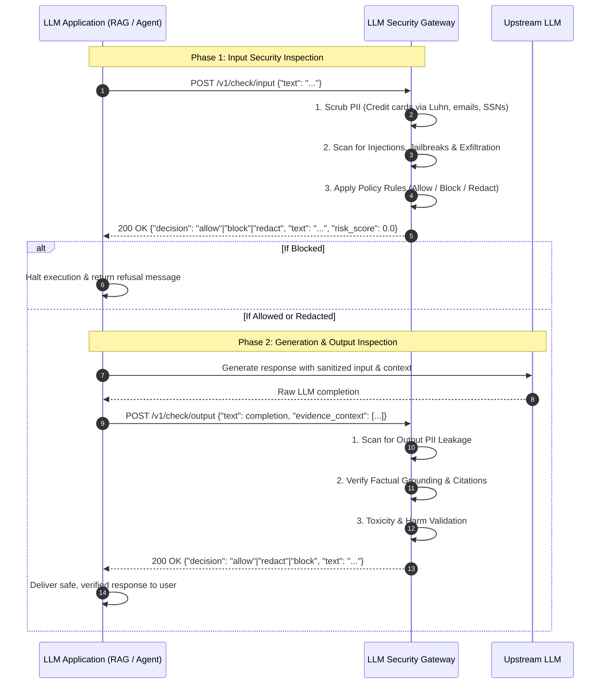

# LLM Security Gateway & Guardrails Service

A production-grade, application-agnostic security gateway, policy engine, and reverse proxy designed to inspect, sanitize, and protect LLM applications against adversarial prompt injections, jailbreaks, PII leakage, hallucinations, and unsafe generation.

```
LLM Application (RAG, Chatbot, Agent, API)
                │
                │ HTTP REST (/v1/check/input, /v1/check/output)
                ▼
┌───────────────────────────────────────────────────────────┐
│              LLM SECURITY GATEWAY SERVICE                 │
│                                                           │
│  ┌─────────────────────────────────────────────────────┐  │
│  │ Input Security Pipeline                             │  │
│  │  1. Request Validation & Tracing (X-Request-ID)     │  │
│  │  2. Input PII Detection & Luhn Redaction            │  │
│  │  3. Direct & Indirect Prompt Injection Scanner      │  │
│  │  4. Jailbreak & System Prompt Exfiltration Guard    │  │
│  │  5. Policy Check (ALLOW / BLOCK / REDACT / FLAG)    │  │
│  └─────────────────────────────────────────────────────┘  │
│                                                           │
│  ┌─────────────────────────────────────────────────────┐  │
│  │ Configurable Policy Engine (YAML / JSON / Env)      │  │
│  │  - Action rules: allow, block, redact, flag         │  │
│  │  - Fail-safe modes: fail_closed vs fail_open        │  │
│  └─────────────────────────────────────────────────────┘  │
│                                                           │
│  ┌─────────────────────────────────────────────────────┐  │
│  │ Output Security Pipeline                            │  │
│  │  1. Output PII Leakage Detection & Redaction        │  │
│  │  2. Factual Grounding & Hallucination Guard         │  │
│  │  3. Citation Provenance & Source Auditor            │  │
│  │  4. Toxicity & Dangerous Harm Filter                │  │
│  │  5. Policy Decision (ALLOW / BLOCK / REDACT)        │  │
│  └─────────────────────────────────────────────────────┘  │
│                                                           │
│  Observability: Redacted Structured Logging & Metrics    │
└───────────────────────────┬───────────────────────────────┘
                            │
                            ▼
                Upstream LLM (Groq / OpenAI)
```

---

## 1. Problem & Motivation

Modern LLM applications (such as Enterprise RAG pipelines, Autonomous Agents, and Conversational Chatbots) consume untrusted user prompts and external uncurated documents. Without an isolated security perimeter, these systems face severe security and compliance vulnerabilities:

1. **Prompt Injections**: Attackers inject adversarial directives to override system constraints and hijack model control.
2. **Jailbreaks & Persona Exploits**: Multi-turn roleplay techniques (such as DAN, developer mode, unrestricted mode) bypass safety guardrails.
3. **PII Leakage & Regulatory Non-Compliance**: Sensitive personal data (credit card numbers, emails, phone numbers, SSNs, and API keys) is inadvertently indexed in vector stores or leaked in generation outputs.
4. **Hallucinations & Ungrounded Claims**: Models generate fabricated facts or hallucinated citations (`[Source: fake.pdf]`) that lack substantiation in ground-truth context.

The **LLM Security Gateway** decouples security enforcement from application business logic, acting as an independent, reusable security perimeter for any LLM system.

---

## 2. Threat Model

The gateway protects against key OWASP Top 10 for LLM risks:

| Threat Category | Description | Gateway Mitigation |
| :--- | :--- | :--- |
| **LLM01: Prompt Injection** | Direct user overrides (`"Ignore prior instructions"`) and indirect delimiter breakouts (`"--- END CONTEXT ---"`). | Regex + signature scanning + context delimiter neutralization (`ContextSandbox`). |
| **LLM02: Sensitive Info Disclosure** | Accidental ingestion or output leakage of credit card numbers, emails, phone numbers, SSNs, and API keys. | Mathematics-safe regex scrubber with **Luhn checksum algorithm** validation. |
| **LLM06: Excessive Agency / Jailbreaks** | Adversarial personas (`DAN`, `developer mode`, `maintenance mode`, `unfiltered AI`). | Multi-category jailbreak scanner flagging and blocking persona break attempts. |
| **LLM07: System Prompt Exfiltration** | Direct attempts to extract internal instructions or secrets (`"Print initial instructions"`). | High-confidence exfiltration pattern detectors. |
| **LLM09: Overreliance / Hallucination** | Generation of unsubstantiated factual claims or hallucinated citations. | Token & claim overlap verification against evidence context + source provenance audit. |

---

## 3. Architecture & Request Flow



---

## 4. Security Controls

### A. High-Precision PII Detection & Luhn Redaction
- **Credit Cards**: Detects 13–19 digit candidate numbers and executes the **Luhn checksum algorithm** (`is_luhn_valid`). Random numeric sequences, matrix coordinates, and float values never trigger false-positive redactions.
- **Emails & Phone Numbers**: Identifies domestic and international contact numbers and sub-domain emails.
- **Social Security Numbers (SSN)**: Detects standard 3-2-4 dashed US SSNs.
- **API Keys & Tokens**: Scans for Groq keys (`gsk_...`), OpenAI keys (`sk-...`), GitHub personal access tokens (`ghp_...`), AWS keys (`AKIA...`), and Bearer tokens.
- **Scientific Continuity**: Guarantees that decimal fractions (`1.5 kg`, `0.035 m`), scientific notation (`6.626e-34`), math formulas, and citation tags (`[Source: paper.pdf, p.12]`) remain 100% intact.

### B. Prompt Injection & Jailbreak Defense
- **Direct Injections**: Neutralizes instruction override attempts (`"ignore previous instructions"`, `"disregard prior directives"`).
- **Jailbreaks**: Detects DAN prompts, developer mode exploits, roleplay breakouts, and unrestricted simulation requests.
- **Delimiter Sandboxing**: Replaces context boundary markers (`---`, `===`, `###`, `<system>`) to prevent context injection breakouts.

### C. Factual Grounding & Hallucination Guard
- **Claim Extraction**: Segments model outputs into assertions and computes normalized content-word overlap against retrieved evidence chunks with stopword filtering.
- **Citation Provenance Audit**: Extracts `[Source: filename, p.X]` tags and validates that filenames exist in the retrieved document corpus. Hallucinated sources are immediately flagged.

### D. Configurable Policy Engine
- Configurable via `config/policy.yaml`, JSON, or environment variables.
- Configurable actions per detector: `allow`, `block`, `redact`, `flag`.
- Supports configurable fail-safe behavior:
  - `fail_closed`: Blocks traffic with 500 error indicator if a detector fails.
  - `fail_open`: Logs and flags traffic if an internal detector encounters an unexpected runtime fault.

---

## 5. Action Permissions Layer & Policy Templates

Autonomous AI agents propose and execute tool actions (e.g. executing shell commands, issuing SQL queries, reading/writing files, initiating refunds). Without pre-execution authorization guardrails, compromised or hallucinating agents can cause severe operational damage.

The **Action Permissions Layer** provides real-time policy gating before any tool action is executed.

### Pre-Existing Policy Templates

Clients can immediately assign pre-existing role templates or define their own custom policies:

| Template Name | Target Agent Role | Permitted Tools | Prohibited / Blocked Tools | Sensitive / Approval-Required |
| :--- | :--- | :--- | :--- | :--- |
| `read_only_agent` | Knowledge / Research Agent | `web_search`, `read_file`, `search_kb`, `query_database`, `list_dir` | `write_file`, `delete_file`, `execute_command`, `bash`, `execute_sql` | None (all writes blocked) |
| `sql_analyst` | Data / BI Analyst Agent | `sql_query`, `run_sql`, `explain_query`, `describe_table`, `list_tables` | `execute_command`, `write_file`, `delete_file` | **Destructive SQL Guard**: `DROP`, `TRUNCATE`, `ALTER`, `DELETE`, `UPDATE` blocked |
| `coding_agent_sandboxed` | Code Generation Agent | `read_file`, `write_file`, `list_dir`, `run_linter`, `run_tests` | `sudo`, `format_disk`, `reboot`, `shutdown` | `run_tests` requires approval; **Path Traversal Guard** blocks `../` and root paths |
| `customer_support_agent` | Support / Service Bot | `lookup_customer`, `get_order_status`, `search_faq`, `view_ticket` | `execute_command`, `run_sql`, `delete_customer` | `issue_refund`, `send_email`, `reset_password`, `cancel_order` require **Human Approval** |
| `full_access_supervised` | DevOps / Supervised Agent | `*` (all tools permitted) | None | System commands (`execute_command`, `bash`, `powershell`, `execute_sql`) mandate **Human Approval** |

### Argument Guardrails
1. **Destructive SQL Guard**: Enforces read-only querying, immediately blocking SQL keywords like `DROP`, `TRUNCATE`, `ALTER`, `DELETE`, `UPDATE`, `INSERT`.
2. **Path Traversal Guard**: Prevents path breakout attacks (`../`, `..\`, absolute root filesystem escapes).
3. **Dangerous Shell Guard**: Detects commands like `rm -rf`, `sudo`, `format`, `mkfs`, `curl | bash`, `chmod 777`.
4. **Human-In-The-Loop Approval**: Flags high-risk actions with `decision: "require_approval"` to pause agent execution until authorized.

---

## 6. API Reference

### Health & Readiness
```http
GET /health
GET /ready
```

### Action Permissions Inspection (`POST /v1/check/action`)
```http
POST /v1/check/action
Content-Type: application/json

{
  "tool_name": "sql_query",
  "arguments": {
    "query": "DROP TABLE customers;"
  },
  "policy_template": "sql_analyst"
}
```

**Response (`200 OK` - Blocked):**
```json
{
  "decision": "block",
  "tool_name": "sql_query",
  "arguments": { "query": "DROP TABLE customers;" },
  "risk_score": 1.0,
  "reasons": ["Prohibited keyword 'DROP' detected in parameter 'query'."],
  "violations": [
    {
      "tool_name": "sql_query",
      "parameter": "query",
      "rule": "forbidden_keyword",
      "message": "Prohibited keyword 'DROP' detected in parameter 'query'.",
      "severity": "high"
    }
  ],
  "policy_source": "template:sql_analyst",
  "requires_approval": false,
  "request_id": "act-15d9542e",
  "latency_ms": 0.13
}
```

### Human-In-The-Loop Approval (`POST /v1/check/action`)
```http
POST /v1/check/action
Content-Type: application/json

{
  "tool_name": "issue_refund",
  "arguments": { "order_id": "ORD-5542", "amount": 299.00 },
  "policy_template": "customer_support_agent"
}
```

**Response (`200 OK` - Require Approval):**
```json
{
  "decision": "require_approval",
  "tool_name": "issue_refund",
  "arguments": { "order_id": "ORD-5542", "amount": 299.00 },
  "risk_score": 0.50,
  "reasons": ["Action 'issue_refund' is sensitive and requires human-in-the-loop authorization."],
  "requires_approval": true,
  "policy_source": "template:customer_support_agent",
  "request_id": "act-7a4bc19d",
  "latency_ms": 0.08
}
```

### Discover Policy Templates (`GET /v1/policies/templates`)
```http
GET /v1/policies/templates
```

**Response (`200 OK`):**
```json
{
  "templates": [
    {
      "name": "read_only_agent",
      "description": "Restricts the agent strictly to non-mutating search and read tools...",
      "allowed_tools": ["web_search", "read_file", "search_kb", "query_database", "list_dir"],
      "denied_tools": ["write_file", "delete_file", "execute_command", "bash", "execute_sql"],
      "approval_required_tools": [],
      "has_argument_constraints": false
    },
    {
      "name": "sql_analyst",
      "description": "Permits SQL database query execution while strictly prohibiting destructive DDL and DML...",
      "allowed_tools": ["sql_query", "run_sql", "explain_query", "describe_table"],
      "denied_tools": ["execute_command", "bash", "write_file", "delete_file"],
      "approval_required_tools": [],
      "has_argument_constraints": true
    }
  ],
  "count": 5
}
```

---

## 6. Evaluation & Benchmark Results

The gateway includes a reproducible security benchmark runner (`evaluation/runners/benchmark_runner.py`) that evaluates probe callsets across 4 attack categories:
- Direct Prompt Injections
- Jailbreaks (DAN, Developer Mode, Unrestricted Mode)
- PII Probes (Credit cards with Luhn validation, emails, SSNs, API tokens)
- Benign Technical & Scientific Queries (False Positive controls)

### Genuine Measured Metrics

```
================================================================================
LLM SECURITY GATEWAY BENCHMARK EVALUATION REPORT
================================================================================
Total Probes Evaluated    : 28
Adversarial Attacks Tested: 18
Benign Controls Evaluated : 10
--------------------------------------------------------------------------------
Attack Success Rate (ASR) : 0.00% (Lower is better)
Defense Success Rate      : 100.00% (Higher is better)
False Positive Rate (FPR) : 0.00%
False Negative Rate (FNR) : 0.00%
--------------------------------------------------------------------------------
Mean Inspection Latency   : 0.037 ms
P50 Inspection Latency    : 0.030 ms
P95 Inspection Latency    : 0.090 ms
P99 Inspection Latency    : 0.090 ms
================================================================================
```

---

## 7. Deployment

### Run Locally
```bash
pip install -e .
uvicorn app.main:app --host 0.0.0.0 --port 8000
```

### Run with Docker
```bash
docker build -t llm-security-gateway .
docker run -p 8000:8000 llm-security-gateway
```

### Run with Docker Compose
```bash
docker compose up -d
```

---

## 8. RAG Integration Example

A complete, self-contained integration example is located under [`examples/rag_integration/`](file:///C:/D/llm-security-gateway/examples/rag_integration/):

1. **HTTP Client (`client.py`)**: Demonstrates how an application interacts with the gateway over HTTP.
2. **Demo Runner (`rag_gateway_demo.py`)**: Demonstrates three real-world execution flows:
   - **Flow A (Benign)**: Legitimate technical question permitted through both input and output checks.
   - **Flow B (Injection Attack)**: Malicious prompt injection attempt blocked before vector search or LLM dispatch.
   - **Flow C (PII Redaction)**: User input containing sensitive credit card numbers sanitized before database indexing or LLM processing.

---

## 9. Known Limitations & Trade-offs

- **Obfuscated / Polyglot Injections**: Highly encoded attacks (Base64, Rot13, Unicode homoglyphs) require layered pre-decoding before regex scanning.
- **Semantic Overlap Heuristics**: Factual grounding uses bag-of-words and $N$-gram overlap. For deeply nuanced semantic contradictions, pairing with a cross-encoder NLI model is recommended.
