# Production-Grade LLM Security Gateway for Agentic AI

[](https://github.com/ShhlokRastogi/LLM-security-gateway/actions/workflows/security_ci.yml)
[](https://www.python.org/downloads/)
[](https://opensource.org/licenses/MIT)

A framework-independent, production-oriented security gateway and policy engine designed to secure **Agentic AI systems, RAG pipelines, and LLM applications**.

The gateway establishes and governs three fundamental security perimeters:

```text
1. USER  → AGENT   (Input Security)   : Prompt injections, jailbreaks, PII scrubbing, exfiltration
2. AGENT → USER    (Output Security)  : PII leakage, factual grounding, citation provenance, toxicity
3. AGENT → TOOL    (Action Security)  : Permissions, argument validation, multi-factor risk, policy, human approval
```

> **Core Security Rule:** An autonomous agent must **never** directly invoke a protected tool without passing through the Security Gateway. The LLM proposes actions, but the Security Gateway authorizes execution.

---

## 1. High-Level Architecture

```text
                         CLIENT / APPLICATION
                                  │
                                  ▼
                       ┌─────────────────────┐
                       │  LLM SECURITY       │
                       │      GATEWAY        │
                       └──────────┬──────────┘
                                  │
                ┌─────────────────┼─────────────────┐
                ▼                 ▼                 ▼
          INPUT GUARD       OUTPUT GUARD      ACTION GUARD
         (Injections/PII)  (Grounding/Leak)         │
                                      ┌─────────────┴─────────────┐
                                      ▼                           ▼
                                 Permissions                 Tool Registry
                               (Agent -> Tools)            (Schemas & Risks)
                                      │
                                      ▼
                              Argument Validation
                            (Types, Ranges, RegEx)
                                      │
                                      ▼
                                  Risk Engine
                               (Multi-factor 0-1)
                                      │
                                      ▼
                            Declarative Policy AST
                               (AND / OR / NOT)
                                      │
                              ┌───────┴────────┐
                              ▼                ▼
                       Custom Policies    Templates
                              └───────┬────────┘
                                      ▼
                               Decision Engine
                              /       │       \
                             ▼        ▼        ▼
                           ALLOW   APPROVAL   DENY
                                      │
                                    HUMAN
                                   APPROVAL
                                  (HMAC & TTL)
                                      │
                                 ┌────┴────┐
                                 ▼         ▼
                           TOOL EXECUTION  AUDIT LOG
```

---

## 2. Request & Execution Flow

```mermaid
sequenceDiagram
    participant User as User / Client
    participant Agent as Autonomous Agent
    participant Gateway as Security Gateway
    participant Tool as Target System / Tool

    User->>Agent: 1. Prompt / Goal
    Agent->>Gateway: 2. POST /v1/check/input
    Note over Gateway: PII Scrubber (Luhn Algorithm)<br/>Prompt Injection & Jailbreak Defense
    Gateway-->>Agent: ALLOW (Clean Input)

    Agent->>Agent: 3. Plans Execution & Generates Tool Call
    
    rect rgb(20, 35, 55)
    Note over Agent,Gateway: Action Security Perimeter
    Agent->>Gateway: 4. POST /v1/actions/check (Tool + Arguments)
    Note over Gateway: 1. Permission Matrix Check<br/>2. Schema & Argument Validation<br/>3. Multi-factor Risk Scoring<br/>4. Declarative Policy Evaluation
    end

    alt Policy: ALLOW
        Gateway-->>Agent: Decision: ALLOW (allowed_to_execute: true)
        Agent->>Tool: 5a. Execute Tool
        Tool-->>Agent: Execution Result
    else Policy: REQUIRE_APPROVAL
        Gateway-->>Agent: Decision: REQUIRE_APPROVAL (approval_id: "appr-xyz")
        Note over Gateway,User: Human Supervisor Reviews Request via API / Dashboard
        User->>Gateway: POST /v1/approvals/appr-xyz/approve
        Agent->>Gateway: 5b. POST /v1/actions/check with approval_id
        Gateway-->>Agent: Decision: ALLOW (Approval Consumed & Validated)
        Agent->>Tool: Execute Tool
    else Policy: DENY
        Gateway-->>Agent: Decision: DENY (Execution Blocked)
        Note over Agent: Tool is NEVER executed
    end
```



---

## 3. Core Subsystems

### A. Action Security & Tool Registry (`app/tools/`)
The gateway does not assume a fixed, hardcoded toolset. Clients register arbitrary tools dynamically with full parameter schemas:
- **Dynamic Tool Registry CRUD**: `POST /v1/tools`, `GET /v1/tools`, `PATCH /v1/tools/{id}`, `DELETE /v1/tools/{id}`.
- **Data Types**: `string`, `integer`, `float`, `boolean`, `array`, `object`.
- **Constraint Directives**: `allowed_values`, `min_value`, `max_value`, `max_length`, `regex_pattern`, `forbidden_keywords`, `forbidden_patterns`.
- **Risk Categorization**: `READ_ONLY`, `DATA_MUTATION`, `SYSTEM_COMMAND`, `FINANCIAL`, `PRIVILEGED`, `EXTERNAL_COMMUNICATION`.

### B. Agent Permissions Matrix (`app/permissions/`)
Separates *capability* from *policy*:
- **Permission**: *"Is this agent allowed to use `refund_payment` at all?"*
- **Policy**: *"If it is permitted, under what conditions, limits, and approval gates?"*
- Configurable per tenant and agent via `POST /v1/agents/{agent_id}/permissions`.

### C. Schema & Argument Validator (`app/tools/validator.py`)
- Validates argument types, required fields, and value bounds against the registered schema.
- **Universal Security Heuristics**:
  - **Path Traversal Guard**: Blocks path breakout attempts (`../`, `..\`, absolute root escapes).
  - **Shell Injection Guard**: Blocks dangerous commands (`rm -rf`, `sudo`, `mkfs`, `format`, `curl | bash`, `chmod 777`).
- Emits structured, explainable `ArgumentValidationError` items instead of silently mutating payloads.

### D. Multi-Factor Risk Engine (`app/risk/`)
Evaluates risk across multiple dimensions into a normalized score ($0.0 \dots 1.0$) and categorical tier:
- **Category Baseline**: `READ_ONLY` ($0.05$), `DATA_MUTATION` ($0.45$), `FINANCIAL` ($0.50$), `SYSTEM_COMMAND` ($0.70$), `PRIVILEGED` ($0.80$).
- **Environment Modifiers**: `production` ($+0.20$), `staging` ($+0.05$).
- **Financial Magnitude**: Flags transactions $> \$500$ ($+0.15$) and $> \$5,000$ ($+0.35$).
- **Destructive Operation Heuristics**: Detects destructive keywords (`DROP`, `TRUNCATE`, `DELETE`, `PURGE`, `DESTROY`).
- **Tier Classification**:
  - `LOW` ($< 0.25$)
  - `MEDIUM` ($0.25 \dots 0.59$)
  - `HIGH` ($0.60 \dots 0.84$)
  - `CRITICAL` ($\ge 0.85$)

### E. Declarative Policy Engine & AST (`app/policy/`)
- **Safe AST Condition Evaluator**: Supports structured trees with `all` (AND), `any` (OR), `not` (NOT), and operators (`equals`, `not_equals`, `greater_than`, `less_than`, `in`, `contains`, `matches_regex`). **Zero arbitrary Python code execution.**
- **Deterministic Precedence**:
  $$\text{DENY} > \text{REQUIRE\_APPROVAL} > \text{ALLOW}$$
  Fails closed on any unexpected evaluation error.

### F. Predefined Versioned Policy Templates (`app/policy/templates.py`)
Pre-packaged role templates ready out-of-the-box:

| Template ID | Target Agent Role | Permitted Tools | Prohibited / Blocked Tools | Sensitive / Approval Gated |
| :--- | :--- | :--- | :--- | :--- |
| `read_only_agent@1.0` | Research / Search Bot | `web_search`, `read_file`, `search_kb`, `query_database`, `list_dir` | `write_file`, `delete_file`, `execute_command`, `bash`, `execute_sql` | All mutating operations blocked |
| `sql_analyst@1.0` | BI / Data Analyst | `sql_query`, `run_sql`, `explain_query`, `describe_table` | `execute_command`, `write_file`, `delete_file` | **Destructive SQL Guard**: `DROP`, `TRUNCATE`, `ALTER`, `DELETE`, `UPDATE` blocked |
| `coding_agent_sandboxed@1.0`| Code Generation Agent | `read_file`, `write_file`, `list_dir`, `run_linter`, `run_tests` | `sudo`, `format_disk`, `reboot`, `shutdown` | `run_tests` requires approval; path traversal blocked |
| `customer_support_agent@1.0`| Support / Service Bot | `lookup_customer`, `get_order_status`, `search_faq`, `view_ticket` | `execute_command`, `run_sql`, `delete_customer` | `issue_refund`, `send_email`, `reset_password` require **Human Approval** |
| `financial_agent@1.0` | FinTech / Billing Bot | `search_orders`, `get_customer`, `refund_payment`, `check_balance` | `execute_code`, `delete_file`, `query_database` | `refund_payment`, `transfer_funds` mandate **Human Approval** |
| `production_agent@1.0` | Production Automation | `search_orders`, `get_customer`, `read_file`, `send_email` | `delete_file`, `execute_code`, `sudo`, `format_disk` | `send_email` requires approval |
| `full_access_supervised@1.0`| DevOps / SRE Bot | `*` (all tools permitted) | None | System-level shell and DB commands mandate **Human Approval** |

Origin tracking distinguishes between `TEMPLATE`, `CUSTOM`, and `CUSTOMIZED_TEMPLATE`.

### G. Cryptographic Human Approval System (`app/approvals/`)
- **Action Hash Binding**: Uses SHA-256 over `(client_id, agent_id, tool_name, sorted_arguments)`.
- **Anti-Replay**: Consuming an approval token marks `is_used = True`. Replaying the same approval token for another call is rejected.
- **TTL Expiration**: Pending approvals expire automatically after a configurable TTL (default 15 minutes).
- **Anti-Self-Approval**: Agents are strictly prohibited from approving their own actions.

### H. Input & Output Security Guards
- **Input Guard**: Scans for direct/indirect prompt injections, DAN/jailbreak personas, delimiter escaping (`ContextSandbox`), and PII scrubbing (Luhn-verified credit cards, SSNs, emails, phone numbers, API keys).
- **Output Guard**: Audits model completions for PII leakage, factual grounding (stopword-filtered claim verification), citation provenance (`[Source: file.pdf, p.X]`), and toxic/harmful content.

### I. Audit Logging & Multi-Tenant Isolation (`app/audit/`)
- Every security decision records `timestamp`, `request_id`, `client_id`, `agent_id`, `tool`, `risk_score`, `risk_level`, `matched_policy`, `decision`, and `approval_id`.
- Automated PII scrubbing on all recorded arguments.
- Strict tenant isolation: Tenant A can never view or modify Tenant B's tools, policies, permissions, or audit logs.

---

## 4. Python SDK Quickstart

Install the SDK directly or use it as an internal module:

```python
from sdk import SecurityGateway, SecurityDenialError, ApprovalRequiredError

# Initialize Gateway client
security = SecurityGateway(
    base_url="http://localhost:8000",
    client_id="enterprise_tenant",
    api_key="sec_gateway_token",
)

# Define your actual tool
def refund_payment(order_id: str, amount: float):
    print(f"Executing refund for {order_id}: ${amount}")
    return {"status": "success"}

# Secure execution wrapper
try:
    result = security.secure_execute(
        agent_id="support_bot",
        tool_name="refund_payment",
        arguments={"order_id": "ORD-101", "amount": 2500.0},
        tool_callable=refund_payment,
        context={"environment": "production"},
    )
    print("Tool Execution Result:", result)

except ApprovalRequiredError as err:
    print(f"Action requires human approval! Token: {err.approval_id}")
    # Human supervisor authorizes action via dashboard or API:
    # security.approve_action(approval_id=err.approval_id, approver_id="supervisor_alice")

except SecurityDenialError as err:
    print(f"Action BLOCKED by policy: {err}")
```

---

## 5. REST API Reference

### Tool Registry
```http
POST   /v1/tools               # Register a new tool with schemas
GET    /v1/tools               # List available tools for client
GET    /v1/tools/{id}          # Get tool details
PATCH  /v1/tools/{id}          # Update tool schema or risk
DELETE /v1/tools/{id}          # Unregister tool
```

### Agent Permissions
```http
POST   /v1/agents/{agent_id}/permissions   # Set allowed & denied tools for an agent
GET    /v1/agents/{agent_id}/permissions   # Get agent permissions
DELETE /v1/agents/{agent_id}/permissions   # Reset agent permissions
```

### Declarative Policies & Templates
```http
POST   /v1/policies                        # Create custom declarative policy
GET    /v1/policies                        # List tenant policies
GET    /v1/policies/{id}                   # Get policy details
DELETE /v1/policies/{id}                   # Delete policy
GET    /v1/policy-templates                # List pre-existing versioned templates
GET    /v1/policy-templates/{id}           # Inspect template configuration
POST   /v1/policy-templates/{id}/apply     # Apply template to an agent
```

### Action Security Gating
```http
POST   /v1/actions/check                   # Comprehensive action pre-execution authorization
```

**Request:**
```json
{
  "client_id": "acme_corp",
  "agent_id": "customer_support_agent",
  "tool_name": "refund_payment",
  "arguments": {
    "order_id": "ORD-5542",
    "amount": 10000.00,
    "currency": "USD"
  },
  "context": {
    "environment": "production"
  }
}
```

**Response (`200 OK` - Require Approval):**
```json
{
  "decision": "REQUIRE_APPROVAL",
  "allowed_to_execute": false,
  "tool_name": "refund_payment",
  "arguments": { "order_id": "ORD-5542", "amount": 10000.0, "currency": "USD" },
  "risk": {
    "risk_level": "HIGH",
    "risk_score": 0.85,
    "factors": ["category_financial", "production_environment", "high_financial_impact"]
  },
  "reasons": ["Financial refund exceeds automatic threshold ($500); human approval required."],
  "policy_id": "pol-refund-safety",
  "policy_version": "1.0",
  "approval_id": "appr-7c2a19ef4b",
  "approval_required": true,
  "request_id": "act-3f81e2aa",
  "latency_ms": 0.35
}
```

### Human Approvals
```http
GET    /v1/approvals                       # List approval requests (status=pending)
GET    /v1/approvals/{id}                  # Get approval request details
POST   /v1/approvals/{id}/approve          # Authorize pending request
POST   /v1/approvals/{id}/deny             # Reject pending request
```

### Audit Logging
```http
GET    /v1/audit/events?limit=50           # Query PII-redacted audit events
```

### Input & Output Guardrails
```http
POST   /v1/check/input                     # Inspect prompt for PII & injection
POST   /v1/check/output                    # Verify completion grounding & leakage
POST   /v1/chat/completions                # Transparent reverse proxy
GET    /health                             # Liveness probe
GET    /ready                              # Readiness probe
```

---

## 6. Running the Service

### Run Locally
```bash
git clone https://github.com/ShhlokRastogi/LLM-security-gateway.git
cd LLM-security-gateway
pip install -e .
uvicorn app.main:app --host 0.0.0.0 --port 8000
```

### Run with Docker Compose
```bash
docker compose up -d
```

### Run the Agent Integration Demo
```bash
python examples/agent_integration/secure_agent_runner.py
```

---

## 7. CI / CD Pipeline

Automated on every push and pull request via [`.github/workflows/security_ci.yml`](.github/workflows/security_ci.yml):
- Full unit & integration testing
- Input and output security evaluation
- Action security & permission benchmarks

---

## 8. License

MIT License. Developed for securing autonomous agentic systems.
